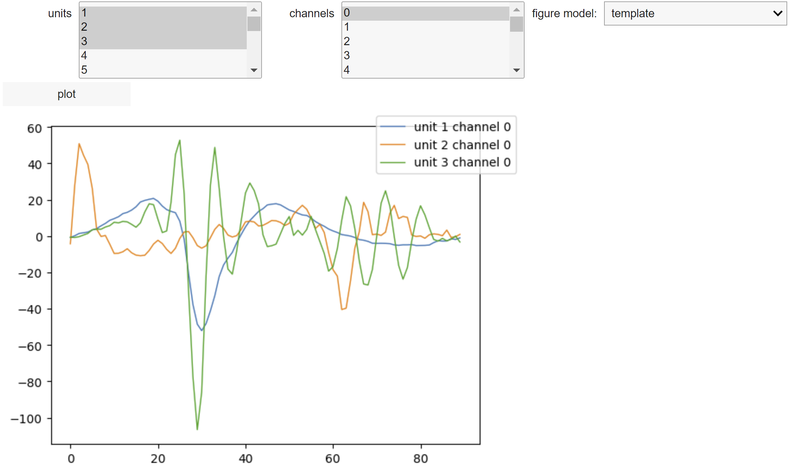
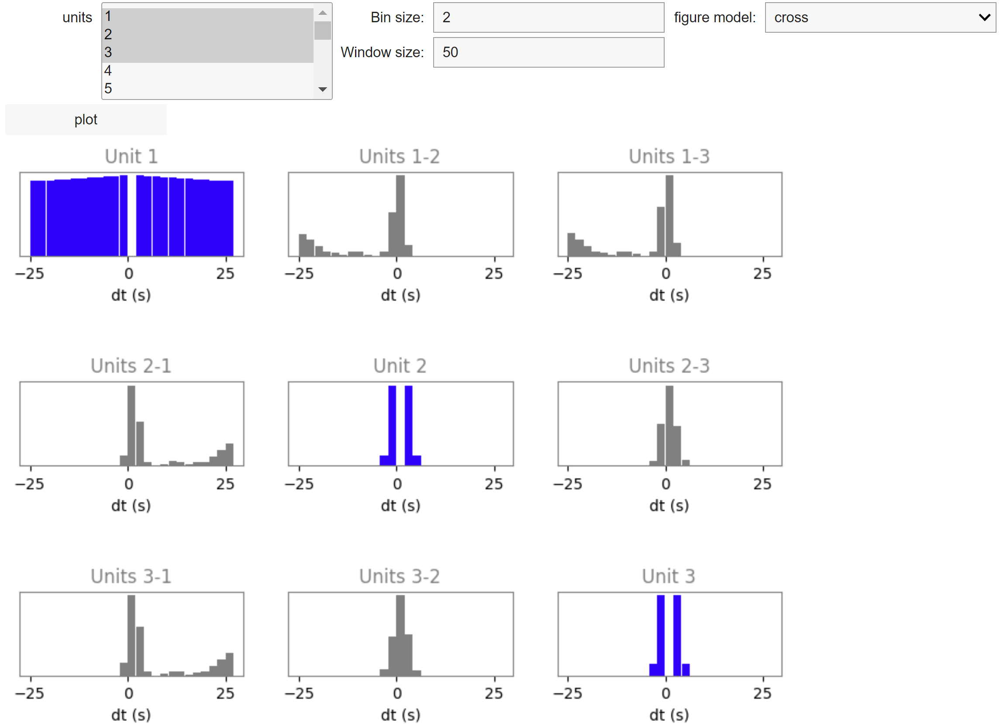
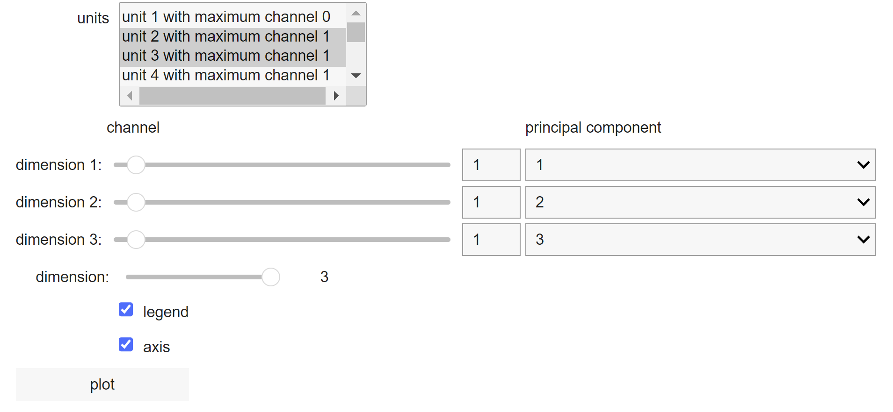
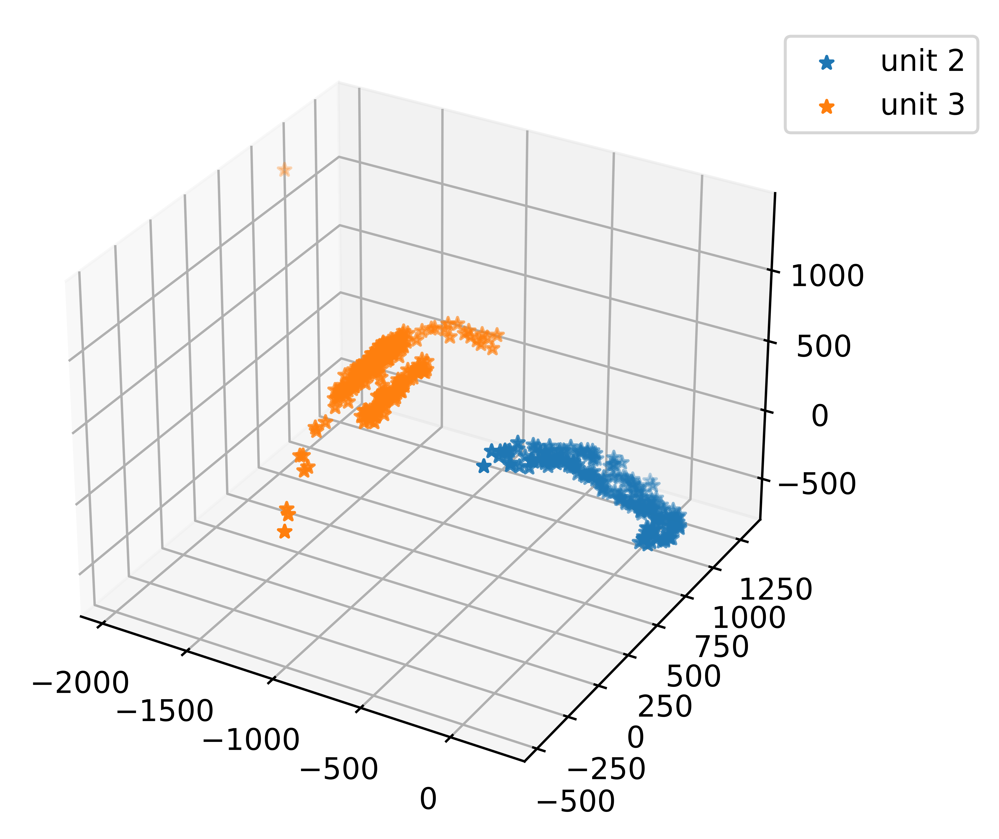
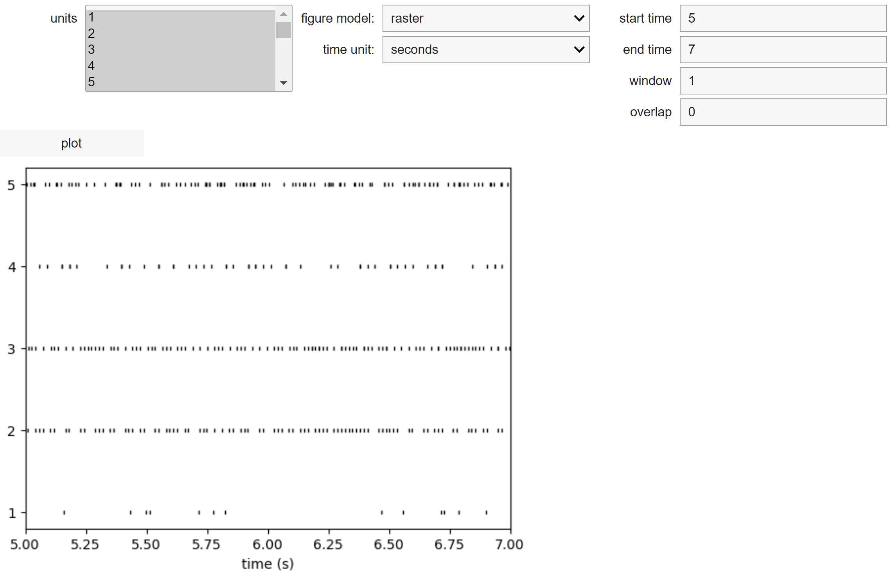
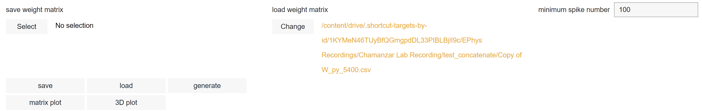
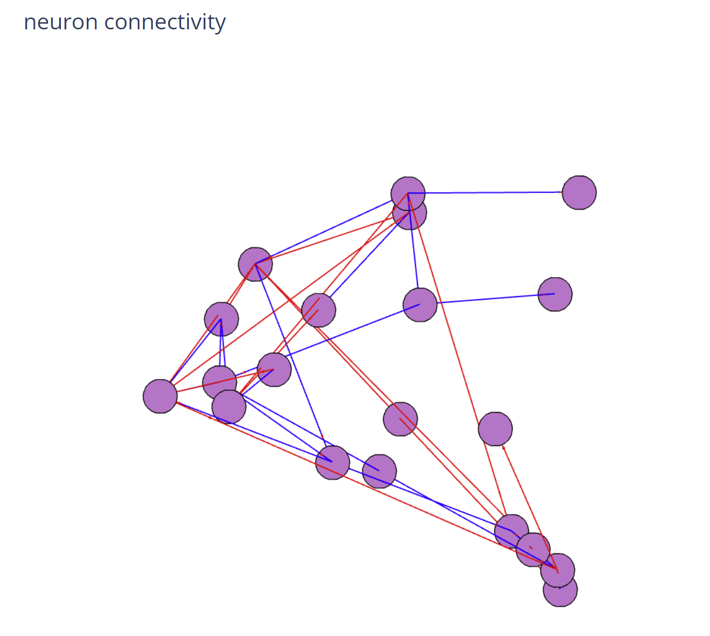

Usage
=====
.. _Connecting:

Connecting files
-------------------
The tutorial is based on Google colab. The first step is connecting Google Drive to a Google Colab Notebook.
For example:

.. code-block:: python

   from google.colab import drive
   drive.mount('/content/drive', force_remount=True)

Select permit, account and allow for the pop-up window.

Dependency
----------
.. note::

   Currently, the dependency of the pipeline is complicated and redundant.

To install and import the related libraries, both in-house and third-party, the following steps are used:

First we need to install third-party libraries:

.. code-block::

   !pip install spiketoolkit==0.7.2
   !pip install spikewidgets==0.5.1
   !pip install spikeextractors==0.8.4
   !pip install spikesorters==0.4.3
   !pip install spikecomparison==0.3.1
   !pip install spikemetrics==0.2.0
   !pip install MEAutility==1.4.6
   !pip install spikeinterface==0.11.0
   !pip install ml_ms4alg

.. note::

   The spikeinterface version in this example is outdated.

Then we import spikeinterface (0.13).

.. code-block::

   import spikeinterface as si
   import spikeinterface.extractors as se
   import spikeinterface.toolkit as st
   import spikeinterface.sorters as ss
   import spikeinterface.comparison as sc
   import spikeinterface.widgets as sw

Next we import other related libraries.

.. code-block::

   import numpy as np
   import matplotlib.pylab as plt
   import matplotlib.image as mpimg
   import pandas as pd
   import scipy.io
   from matplotlib import cm
   import os
   import sys

Finally, we import our own libraries

.. code-block::

   #setup to import our own custom libraries
   import sys
   libdir = "/content/drive/MyDrive/EPhys Recordings/lib"
   sys.path.insert(1, libdir)

   # this is how we can import our own libraries
   from jaylib.histogram import plot_firing_rate
   from jaylib.accumulate import plot_cumulative_spikes

   # dynamically re-imports module
   import importlib
   estherlib_mods = [m for m in sys.modules.keys() if 'esther' in m]
   for m in estherlib_mods:
      importlib.reload(sys.modules[m])
   from estherlib.uniform_60_filtering import uniform_60_filt
   from estherlib.returnDataInfo import *
   from estherlib.datasetObjectModule import *
   from estherlib.cachingModule import *
   from estherlib.runRoutines import *

   from stellalib.custom_raster import custom_raster
   from madilib.waveform_viewer import waveform_subplot

Load dataset
-------------

.. note::

   This part is adapted from `document<https://docs.google.com/document/d/1ORTekIBW8jfAY2d3LeadNTPgP2iLAiqHvzxm37mait0/edit>`_ written by Jay

The parameters of dataset is stored in `chamLabRecordingVariables.xlsx <https://drive.google.com/drive/folders/1fpUvxR17hc5CaAnXwgyjzDOEguGLr4Bh?usp=sharing>`_.
The following is an example of loading one dataset. :code:`dataInd` is the index into the spike sorting variables sheet that you have recently edited. :code:`Filedir` must be set to the target sheet. The remaining variables are sorting parameters. 
The final two lines, :code:`dataObj.loadMountainSort()` and :code:`dataObj.loadVariables()` performs the filtering and spike sorting and loads the results into memory. These can take a long time to execute on the first time for a given dataset. However, the results are cached and can be quickly loaded into memory once the operation has been run once. 

.. code-block::

   dataInd = 121
   spikeProminence = 10
   sortingThreshold = 4
   bandpassLow = 500
   bandpassHigh =7500
   common_mode_rejection = False #Default is True

   display = True
   filedir = "/content/drive/My Drive/EPhys Recordings/Chamanzar Lab Recording/chamLabRecordingVariables.xlsx"

   dataObj = Dataset(filedir, dataInd, spikeProminence, sortingThreshold, bandpassLow, bandpassHigh,detect_sign=0, display = display, cmr_enable = common_mode_rejection) # create data object

   ## Data automatically generated or pulled from cache to create visualizations
   dataObj.loadMountainSort(overide = False)
   dataObj.loadVariables(overide = False)

Processing and visualizations
-----------------------------
The pipeline is based on `SpikeInterface <https://spikeinterface.readthedocs.io/en/latest/>`_ framework. spikeinterface has implemented some useful processing and visualizations.

.. code-block::

   sw.plot_unit_waveforms(sorting=dataObj.sorting_MS4, 
                           recording=dataObj.recording,
                           unit_ids=[1,2,3], 
                           max_spikes_per_unit=100)

We also implement our version of processing and visualizations

.. code-block::

   dataObj.visualize("waveforms", version = "original", overide = False) #unit wavesforms
   dataObj.visualize("isi", version = "original", overide = True, binsize = 30)

Some GUI-based processing and visualizations are available. 
To enable the custom GUI functions, some additional libraries should be installed.

.. code-block::

   !pip install ipympl
   !pip install ipyfilechooser
   import xianglib as xl

The warnings can be disabled:

.. code-block::

   import warnings
   warnings.filterwarnings('ignore')

In order to select multiple items, Hold down the control key and select.

To show the templates, waveforms of units: The first column is unit list, second column is channel list and the last dropdown select template and waveform.

.. code-block::

   xl.waveform_widget(dataObj)

The GUI looks like:

To plot the autocorrelation and crosscorrelation of units: The first is unit list, bin size and window size are in the unit of second(s). The last dropdown select autocorrelation and crosscorrelation.  

.. code-block:: 

   xl.correlation_widget(dataObj)

The GUI looks like:

To show the PCA of units: Select units, and use the slider to select channels for each axis. The dropdown corresponds to which principal component will be plot. A common practice is selecting the maximum channels and order as 1, 2, 3 principal components.

.. code-block::

   xl.pca_analysis(dataObj)

The GUI looks like::

To show the raster plot, ISI and histogram of units:

.. code-block:: 

   xl.histogram_widget(dataObj)

The GUI looks like:

Connectome analysis
-------------------
.. note::
   This is an experimental function and could result in run out of memory error. Please stop the process if not updated for more than 10 mins.

To measure the functional connection between units

.. code-block:: 

   xl.Connection_analysis(dataObj)

The GUI looks like:

